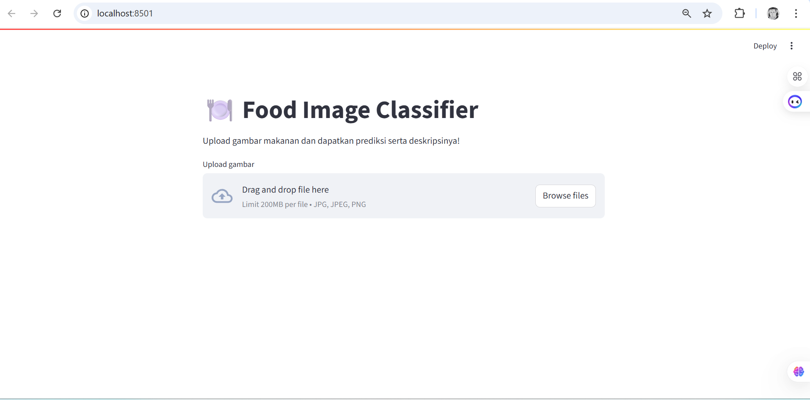

# 🍱 Food Image Classifier with Food-101

Proyek ini adalah sistem klasifikasi gambar makanan menggunakan **deep learning** dan **dataset Food-101**, dengan arsitektur **MobileNetV2** dan teknik fine-tuning. Model mampu mengenali **101 kategori makanan** dari seluruh dunia.

📦 **Dataset**: [Food-101 on Kaggle](https://www.kaggle.com/datasets/kmader/food41)

---

## 🧠 Fitur Utama

* Deteksi otomatis gambar makanan dari file atau kamera
* Model CNN ringan berbasis **MobileNetV2**
* Fine-tuning untuk hasil lebih akurat
* Dataset besar (75.000+ gambar)
* Model disimpan sebagai: `food101_model_final.h5`

---

## 📁 Struktur Proyek

```
food-Classifier-Project/
├── __pycache__/
│   └── food_predictor.cpython-312.pyc
├── data/
│   ├── food-101/
│   │   ├── images/
│   │   └── meta/
│   ├── food_db.json
│   ├── food-101.tar.gz
│   └── temp.jpg
├── saved_model/
│   ├── best_model.h5
│   └── food101_model_final.h5
├── app.py
├── food_predictor.py
├── requirements.txt
├── test_tf.py
└── train_model.py
```

---

## 🚀 Cara Menjalankan

### 1. Instalasi Dependensi

```bash
pip install -r requirements.txt
```

### 2. Unduh dan Ekstrak Dataset

Dataset Food-101 bisa didapat dari Kaggle:

🔗 [https://www.kaggle.com/datasets/kmader/food41](https://www.kaggle.com/datasets/kmader/food41)

Setelah diunduh, ekstrak ke direktori `data/food-101/`.

---

### 3. Latih Model

```bash
python train_model.py
```

---

### 4. Jalankan Aplikasi

```bash
streamlit run app.py
```

---

## ⚙️ Konfigurasi Model

* Arsitektur: MobileNetV2
* Input size: 224x224
* Epoch default: 10 (direkomendasikan 30+ untuk performa optimal)
* Fine-tuning layer atas

---

## ⚠️ Catatan Tambahan

* Pelatihan awal bisa dilakukan dengan epoch rendah jika laptop terbatas
* Akurasi akan membaik seiring jumlah epoch dan kualitas preprocessing
* Bisa mengganti backbone ke ResNet, EfficientNet, dll.

---

## 📷 Contoh Hasil Prediksi



---

## 🧑‍💻 Kontributor

* **Yohanes Nevan** – Pelatihan model, integrasi prediksi, dan antarmuka pengguna
* **Dataset**: ETH Zurich, via [Kaggle: Food-101 by kmader](https://www.kaggle.com/datasets/kmader/food41)

---
